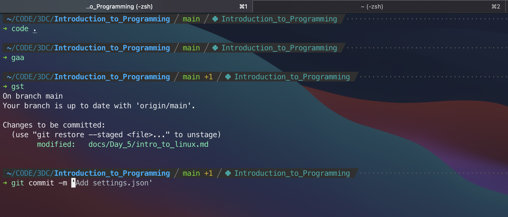

# Day 5: Introduction to Linux & Shell

!!! info ""
    - Date: **09 Feb 2021 (Tuesday)**
    - Time: **6.30pm - 10.30pm**
    - Venue: SUTD i3 Lab (1.605)
    - Online Venue: [Twitch](https://www.twitch.tv/3dcdsc)

-   Introduction Linux (Ubuntu)
-   Introduction to UNIX Shell
-   Introduction to SSH
-   Introduction to Dotfiles Management

---

<figure>
  
  <figcaption>UNIX Shell</figcaption>
</figure>

## Preparation 

For Windows User:

1. Enable and install [Windows Subsystem for Linux 2 (WSL 2)](https://docs.microsoft.com/en-us/windows/wsl/install-win10), you may choose [Ubuntu 20.04 LTS](https://www.microsoft.com/en-sg/p/ubuntu-2004-lts/9n6svws3rx71?rtc=1&activetab=pivot:overviewtab) as your Linux distro choice. 

For macOS User:

1. Download and install [iTerm2](https://iterm2.com/)